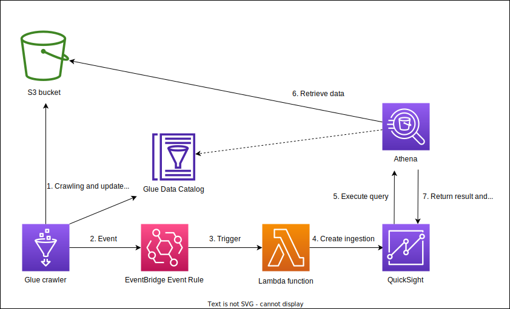

# Architecture

[](./blog_glue_trigger_refresh_qs_spice_architecture_diagram.drawio.svg)

# Set up

## Prerequisites

- QuickSight user.
- AWS CLI
- Permission to run CDK and manipulate QuickSight on CLI

## Setup IAM policies and an environment necessary to deploy the resources

See [Calling AWS services from an environment in AWS Cloud9](https://docs.aws.amazon.com/cloud9/latest/user-guide/credentials.html#credentials-temporary) for more information.

```bash
# Create a role
aws iam create-role --role-name blog-glue-trigger-refresh-qs-spice-cloud9-instance-role --assume-role-policy-document file://cloud9_iam/trust-policy.json

# Attach policies to the role
aws iam attach-role-policy --role-name blog-glue-trigger-refresh-qs-spice-cloud9-instance-role --policy-arn arn:aws:iam::aws:policy/AWSCloud9SSMInstanceProfile
aws iam attach-role-policy --role-name blog-glue-trigger-refresh-qs-spice-cloud9-instance-role --policy-arn arn:aws:iam::aws:policy/AmazonS3FullAccess
aws iam put-role-policy --role-name blog-glue-trigger-refresh-qs-spice-cloud9-instance-role --policy-name blog-glue-trigger-refresh-qs-spice-cloud9-instance-policy --policy-document file://cloud9_iam/inline-policy.json
# AWSCloud9SSMInstanceProfile
aws iam create-instance-profile --instance-profile-name blog-glue-trigger-refresh-qs-spice-cloud9-instance-profile
aws iam add-role-to-instance-profile --instance-profile-name blog-glue-trigger-refresh-qs-spice-cloud9-instance-profile --role-name blog-glue-trigger-refresh-qs-spice-cloud9-instance-role

# Start Cloud9 environment and attach the role to the EC2 instance used by Cloud9
read -s c9_subnet_id; export c9_subnet_id		# Use your own subnet id.
read -s c9_owner_arn; export c9_owner_arn		# Use your own owner arn.
aws cloud9 create-environment-ec2 \
	--name blog-glue-trigger-refresh-qs-spice-cloud9-environment \
	--description "Cloud9 environment for blog-glue-trigger-refresh-qs-spice" \
	--instance-type t2.micro \
	--automatic-stop-time-minutes 60 \
	--image-id amazonlinux-2023-x86_64 \
	--connection-type CONNECT_SSM \
	--subnet-id $c9_subnet_id \
	--owner-arn $c9_owner_arn

# Disassociate default instance profile and associate the instance profile created above to the Cloud9 instance.
c9_instance_id=$(aws ec2 describe-instances --filters Name=tag:Name,Values=*blog-glue-trigger-refresh-qs-spice-cloud9-environment* Name=instance-state-name,Values=running --query "Reservations[*].Instances[*].InstanceId" --output text)
default_iipa_id=$(aws ec2 describe-iam-instance-profile-associations --filters "Name=instance-id,Values=$c9_instance_id" --query "IamInstanceProfileAssociations[0].AssociationId" --output text)
aws ec2 disassociate-iam-instance-profile --association-id $default_iipa_id
aws ec2 associate-iam-instance-profile --iam-instance-profile Name=blog-glue-trigger-refresh-qs-spice-cloud9-instance-profile --instance-id $c9_instance_id
```

### Open the Cloud9 environment to disable "AWS managed temporary credentials".

1. Click the gear icon on the right-top corner of the IDE.
2. Select "AWS SETTINGS" in the left pane.
3. Disable "Credentials > AWS managed temporary credentials".

# Install dependencies of the project

```bash
git clone https://github.com/yuta-cmth/blog-glue-trigger-refresh-qs-spice.git
cd blog-glue-trigger-refresh-qs-spice
npm i
```

# Commands to deploy & clean up

```bash
# set aws account id and region where the current EC2 instance is running.
export QS_DATA_SET_ID='blog-glue-trigger-refresh-qs-spice-dataset'
cdk deploy --require-approval never

# Get bucket name and crawler name from CloudFormation outputs.
bucket_name=$(aws cloudformation describe-stacks --stack-name BlogGlueTriggerStack --output text --query 'Stacks[0].Outputs[?OutputKey==`BlogGlueCrawlerBucketName`].OutputValue')
crawler_name=$(aws cloudformation describe-stacks --stack-name BlogGlueTriggerStack --output text --query 'Stacks[0].Outputs[?OutputKey==`BlogGlueCrawlerName`].OutputValue')
athena_work_group_name=$(aws cloudformation describe-stacks --stack-name BlogGlueTriggerStack --output text --query 'Stacks[0].Outputs[?OutputKey==`BlogGlueAthenaWorkGroupName`].OutputValue')

# Upload s3 object and run crawler.
aws s3 cp ./s3_test_data/data/test1 "s3://${bucket_name}/data/test1"
aws glue start-crawler --name "${crawler_name}"


# -------------- QuickSight --------------
export AAI=$(aws sts get-caller-identity --query "Account" --output text)
read -s QUICKSIGHT_USERNAME; export QUICKSIGHT_USERNAME		# Use your own username. $ aws quicksight list-users --aws-account-id <your account id> --namespace default --region us-east-1 will show the list of users.

# Open the management console QuickSight and give permission to read and write to the S3 bucket.

# Compile jsonnet to json. json will be used to provision QuickSight assets.
# Create a Data source. Prerequisite: Athena workgroup exists.
docker run \
	-v $(pwd):/app \
	-w /app \
	bitnami/jsonnet:latest \
	--ext-str "AWS_ACCOUNT_ID=$AAI" \
	--ext-str "QUICKSIGHT_USERNAME=$QUICKSIGHT_USERNAME" \
	--ext-str "ATHENA_WORKGROUP=$athena_work_group_name" \
	qs_jsonnet/create-data-source.jsonnet > jsonnet.out/create-data-source.json
aws quicksight create-data-source --cli-input-json file://jsonnet.out/create-data-source.json
# Make sure it outputs "CREATION_SUCCESSFUL"
aws quicksight describe-data-source --aws-account-id $AAI --data-source-id blog-glue-trigger-refresh-qs-spice-data-source --query "DataSource.Status"

# Create a Data set
docker run \
	-v $(pwd):/app \
	-w /app \
	bitnami/jsonnet:latest \
	--ext-str "AWS_ACCOUNT_ID=$AAI" \
	--ext-str "QUICKSIGHT_USERNAME=$QUICKSIGHT_USERNAME" \
	--ext-str "DATA_SET_ID=$QS_DATA_SET_ID" \
	qs_jsonnet/create-data-set.jsonnet > jsonnet.out/create-data-set.json
aws quicksight create-data-set --cli-input-json file://jsonnet.out/create-data-set.json

# Create an analysis
docker run \
	-v $(pwd):/app \
	-w /app \
	bitnami/jsonnet:latest \
	--ext-str "AWS_ACCOUNT_ID=$AAI" \
	--ext-str "QUICKSIGHT_USERNAME=$QUICKSIGHT_USERNAME" \
	qs_jsonnet/create-analysis.jsonnet > jsonnet.out/create-analysis.json
aws quicksight create-analysis --cli-input-json file://jsonnet.out/create-analysis.json

# Create a dashboard.
docker run \
	-v $(pwd):/app \
	-w /app \
	bitnami/jsonnet:latest \
	--ext-str "AWS_ACCOUNT_ID=$AAI" \
	--ext-str "QUICKSIGHT_USERNAME=$QUICKSIGHT_USERNAME" \
	qs_jsonnet/create-dashboard.jsonnet > jsonnet.out/create-dashboard.json
aws quicksight create-dashboard --cli-input-json file://jsonnet.out/create-dashboard.json


# Open QuickSight dashboard to see current data on management console.


# Run the following to update the data set after crawling.
aws s3 cp ./s3_test_data/data/test2 "s3://${bucket_name}/data/test2"
aws glue start-crawler --name "${crawler_name}"

# Open QuickSight dashboard again to see if the dashboard is updated.


# ---------------- Clean Up --------------------------
# Delete all resources in QuickSight. Run in Cloud9 IDE.
aws quicksight delete-dashboard --aws-account-id $AAI --dashboard-id blog-glue-trigger-refresh-qs-spice-dashboard
aws quicksight delete-analysis --aws-account-id $AAI --analysis-id blog-glue-trigger-refresh-qs-spice-analysis
aws quicksight delete-data-set --aws-account-id $AAI --data-set-id blog-glue-trigger-refresh-qs-spice-dataset
aws quicksight delete-data-source --aws-account-id $AAI --data-source-id blog-glue-trigger-refresh-qs-spice-data-source

# Emptying the bucket. Without it, cdk destroy will fail. Run in Cloud9 IDE.
aws s3 rm "s3://${bucket_name}" --recursive
cdk destroy --force

# Delete Cloud9 environment and IAM role.
aws cloud9 delete-environment --environment-id <environment_id>
aws iam remove-role-from-instance-profile --instance-profile-name blog-glue-trigger-refresh-qs-spice-cloud9-instance-profile --role-name blog-glue-trigger-refresh-qs-spice-cloud9-instance-role
aws iam delete-instance-profile --instance-profile-name blog-glue-trigger-refresh-qs-spice-cloud9-instance-profile
aws iam detach-role-policy --role-name blog-glue-trigger-refresh-qs-spice-cloud9-instance-role --policy-arn arn:aws:iam::aws:policy/AWSCloud9SSMInstanceProfile
aws iam detach-role-policy --role-name blog-glue-trigger-refresh-qs-spice-cloud9-instance-role --policy-arn arn:aws:iam::aws:policy/AmazonS3FullAccess
aws iam delete-role-policy --role-name blog-glue-trigger-refresh-qs-spice-cloud9-instance-role --policy-name blog-glue-trigger-refresh-qs-spice-cloud9-instance-policy
aws iam delete-role --role-name blog-glue-trigger-refresh-qs-spice-cloud9-instance-role
```

# Utilities

```bash
# Try jsonnet
# compile by jsonnet foo.jsonnet > foo.json
docker run -it -v $(pwd):/app -w /app --entrypoint bash bitnami/jsonnet:latest
# Create an analysis-definition from analysis.
aws quicksight describe-analysis-definition --aws-account-id $AAI --analysis-id <analysis_id> --query 'Definition' > ./qs_jsonnet/analysis-definition.json
# Create dashboard definition from an existing dashboard.
aws quicksight describe-dashboard-definition --aws-account-id $AAI --dashboard-id <dashbaord_id> --query "Definition" > qs_jsonnet/dashboard-definition.json
```

# References

- https://aws.amazon.com/blogs/big-data/event-driven-refresh-of-spice-datasets-in-amazon-quicksight/
- https://community.amazonquicksight.com/t/how-to-move-or-export-and-import-the-dashboard/8262/6
- https://catalog.us-east-1.prod.workshops.aws/workshops/cd8ebba2-2ef8-431a-8f72-ca7f6761713d/en-US/admin-workshop/7-content-porting
- https://docs.aws.amazon.com/cloud9/latest/user-guide/credentials.html#credentials-temporary
